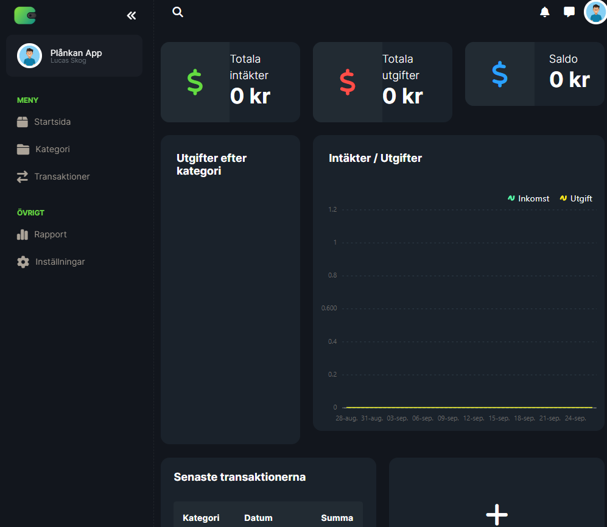

# Plånkan App

## Overview
Plånkan App is an ASP.NET Core web application designed to simplify personal finance management. It allows users to track their expenses, categorize them, and view financial insights through a user-friendly dashboard. This project aims to provide a comprehensive tool for budgeting and financial tracking.




## Features
- **Transaction Management:** Record and track your daily expenses and incomes with ease.
- **Categories:** Organize your transactions into categories for better financial management.
- **Dashboard:** Get a quick overview of your financial health with our intuitive dashboard.
- **Responsive Design:** Access your financial data on any device, thanks to our responsive web design.
- **Printable Report:** Get a visiual summary of your transations between from any date of your choice.

## Technology Stack
- **Backend:** ASP.NET Core
- **ORM:** Entity Framework Core for database operations
- **Frontend:** HTML, CSS (Bootstrap), JavaScript (jQuery)
- **Database:** SQL Server (can be configured in `appsettings.json`)

## Getting Started

### Prerequisites
- [.NET 5.0 SDK](https://dotnet.microsoft.com/download)
- [SQL Server](https://www.microsoft.com/en-us/sql-server/sql-server-downloads) (or any compatible SQL database)
- [Visual Studio](https://visualstudio.microsoft.com/downloads/) (recommended) or another IDE with C# support

### Setup
1. Clone the repository to your local machine:
   ```bash
   git clone https://github.com/sockulags/plankan-app.git
   ```
2. Navigate to the project directory:
   ```bash
   cd plankan-app/Expense_Tracker
   ```
3. Update the connection string in `appsettings.json` to match your database configuration.
4. Apply migrations to create the database schema:
   ```bash
   dotnet ef database update
   ```
5. Run the application:
   ```bash
   dotnet run
   ```
6. Open your browser and navigate to `https://localhost:5001` to view the application.

